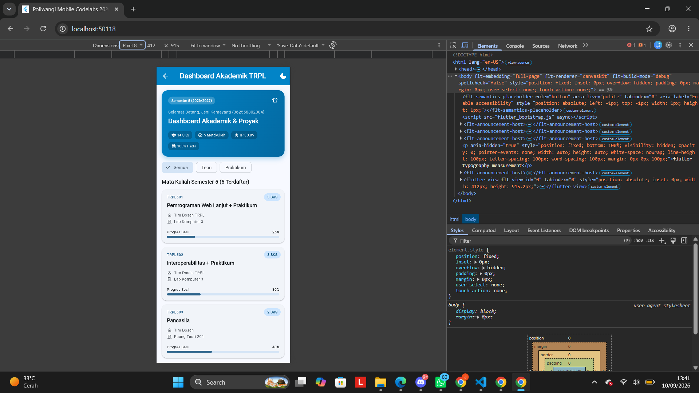
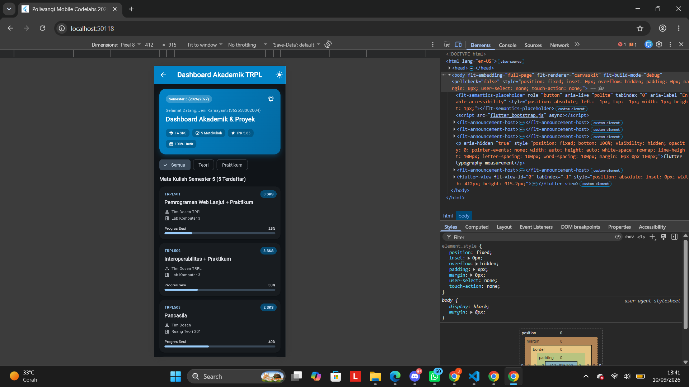
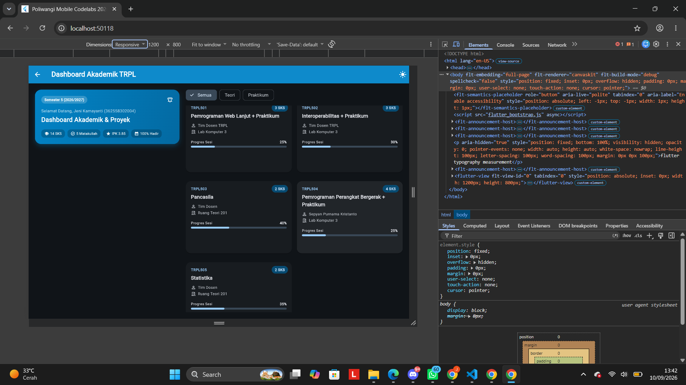

# Laporan Praktikum Modul 02: Declarative UI & Responsive Layout

- **Nama**: Jeni kamayanti
- **NIM**: 362558302004
- **Kelas / Prodi**: 2E/Teknologi Rekayasa Perangkat Lunak 
- **Mata Kuliah**: Pemrograman Perangkat Bergerak (Semester 3)

---

## 1. Ringkasan Implementasi
Pada modul ini saya membuat dashboard akademik menggunakan Flutter dengan tampilan yang bisa menyesuaikan ukuran layar. Saya menggunakan `LayoutBuilder` untuk membedakan tampilan antara layar yang lebih kecil dan layar yang lebih lebar. Pada layar kecil, data mata kuliah ditampilkan dalam satu kolom, sedangkan pada layar yang lebih lebar ditampilkan menjadi dua bagian dengan card mata kuliah.
Saya juga menggunakan Material 3 untuk mengatur tema aplikasi. Selain itu, saya menambahkan filter kategori mata kuliah menggunakan pilihan Semua, Teori, dan Praktikum. Saya juga menambahkan fitur dark mode dan BottomSheet untuk melihat detail dari mata kuliah ketika card ditekan.
## 2. Bukti Tangkapan Layar (Running App)
| Mode Portrait (Light) | Mode Dark Theme | Mode Landscape / Tablet (2 Kolom) |
|---|---|---|
|  |  |  |

## 3. Kendala Layout yang Dihadapi & Solusinya
- **Kendala**:Pada saat membuat card mata kuliah, beberapa nama mata kuliah cukup panjang sehingga bisa membuat tampilan card menjadi kurang rapi.
- **Solusi**:Saya menggunakan `maxLines` dan `TextOverflow.ellipsis` pada teks nama mata kuliah supaya teks yang terlalu panjang tidak membuat layout menjadi overflow.
Selain itu, saya juga menyesuaikan tampilan menggunakan `LayoutBuilder` supaya tampilan aplikasi tetap nyaman digunakan pada ukuran layar yang berbeda.

## 4. Jawaban Pertanyaan Refleksi
1. **Efisiensi Single-pass BoxConstraints**: [Menurut saya, BoxConstraints membantu Flutter menentukan ukuran widget sesuai dengan ruang yang tersedia. Dengan begitu Flutter tidak perlu mencoba ukuran secara sembarangan dan layout bisa dibuat lebih efisien.]
2. **Kriteria Modularisasi Widget**: [Menurut saya widget sebaiknya dipisahkan jika mempunyai fungsi atau tampilan yang berbeda dan digunakan sebagai bagian tersendiri. Pada modul ini saya memisahkan `CourseCard` dan `HeaderBanner` supaya kode lebih mudah dibaca dan tidak semuanya berada dalam satu file.]
3. **Manfaat M3 ThemeData Terpusat**: []